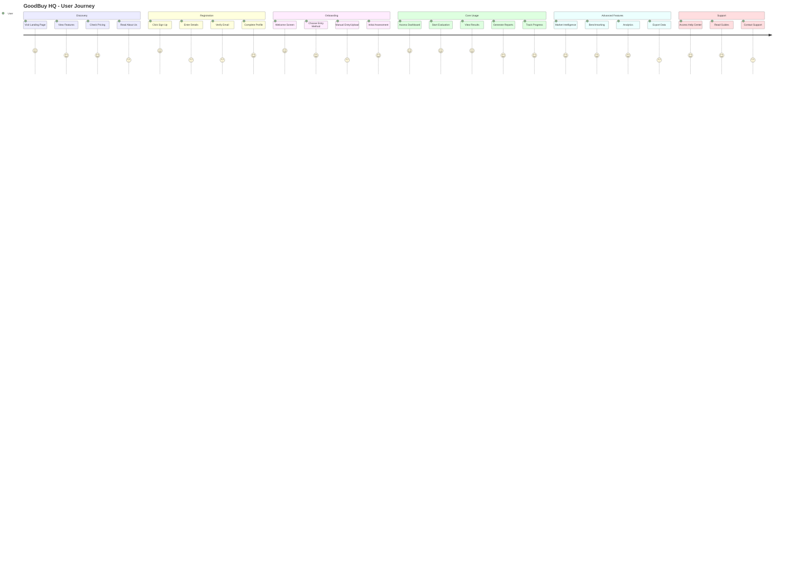
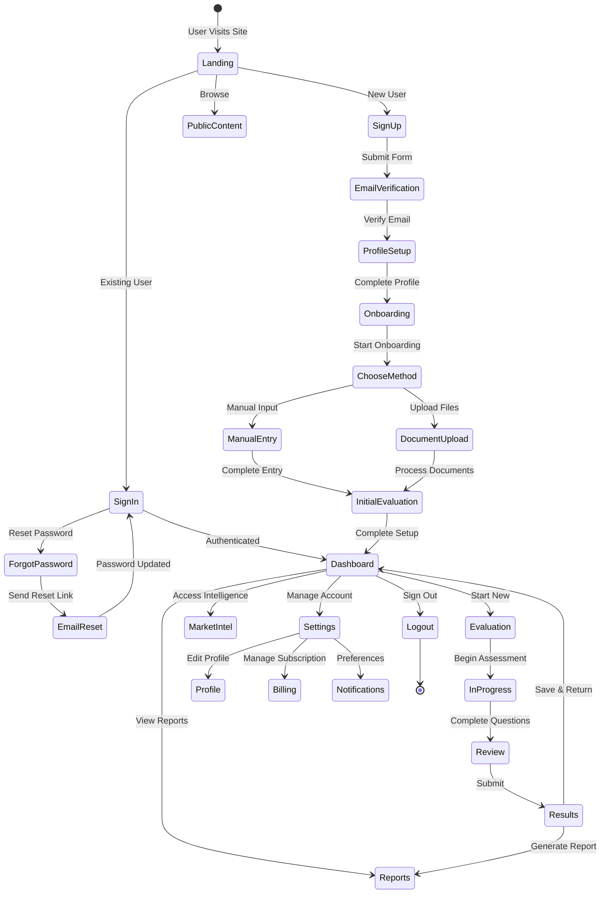
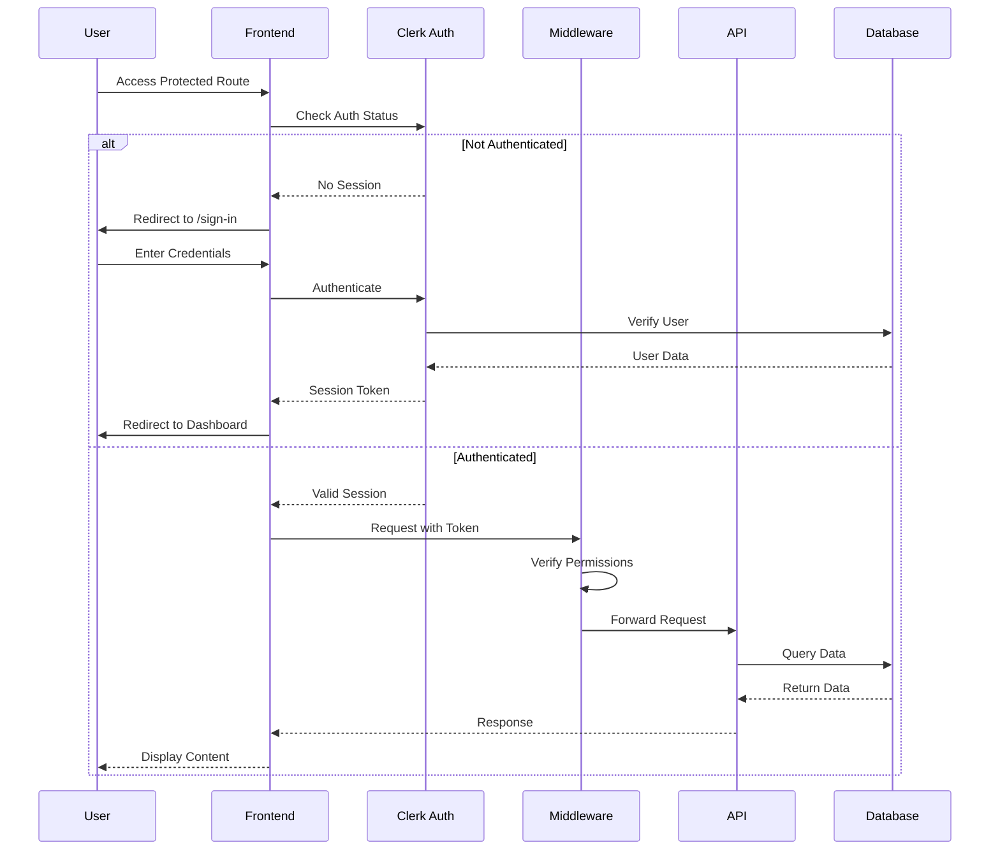
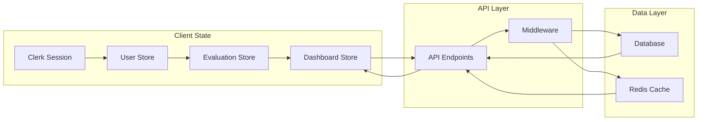
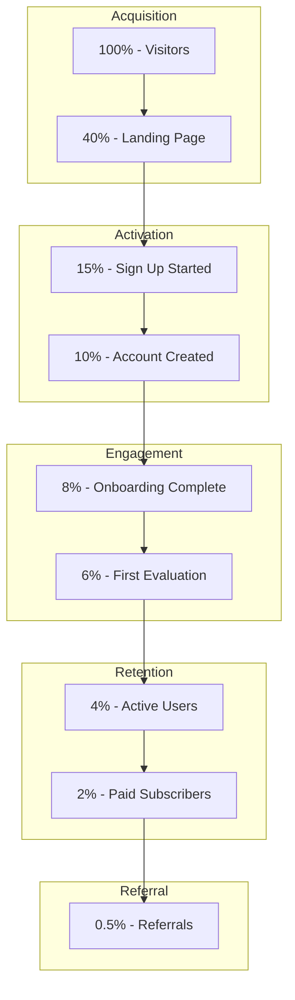

# GoodBuy HQ - Site Map and User Flow Documentation

## 🗺️ Site Map Structure

```mermaid
graph TD
    %% Define styles
    classDef publicPage fill:#e1f5fe,stroke:#01579b,stroke-width:2px
    classDef authPage fill:#fff3e0,stroke:#e65100,stroke-width:2px
    classDef protectedPage fill:#e8f5e9,stroke:#1b5e20,stroke-width:2px
    classDef adminPage fill:#fce4ec,stroke:#880e4f,stroke-width:2px
    classDef apiEndpoint fill:#f3e5f5,stroke:#4a148c,stroke-width:2px

    %% Root
    Home[🏠 Landing Page /]:::publicPage

    %% Authentication Branch
    Home --> Auth[🔐 Authentication]:::authPage
    Auth --> SignIn[Sign In /sign-in]:::authPage
    Auth --> SignUp[Sign Up /sign-up]:::authPage
    Auth --> ResetPassword[Reset Password /auth/reset-password]:::authPage

    %% Public Pages Branch
    Home --> Public[📄 Public Pages]:::publicPage
    Public --> Pricing[💰 Pricing /pricing]:::publicPage
    Public --> About[ℹ️ About /about]:::publicPage
    Public --> Contact[📧 Contact /contact]:::publicPage
    Public --> Privacy[🔒 Privacy /privacy]:::publicPage
    Public --> Terms[📜 Terms /terms]:::publicPage

    %% Protected Dashboard Branch
    Home --> Dashboard[📊 Dashboard /dashboard]:::protectedPage
    Dashboard --> Evaluation[📝 Evaluation]:::protectedPage
    Evaluation --> EvalStart[Start Evaluation /evaluation]:::protectedPage
    Evaluation --> EvalDetail[Evaluation Details /evaluation/{id}]:::protectedPage

    %% Onboarding Flow
    Dashboard --> Onboarding[🚀 Onboarding /onboarding]:::protectedPage
    Onboarding --> OnboardManual[Manual Entry /onboarding/manual]:::protectedPage
    Onboarding --> OnboardUpload[Document Upload /onboarding/document-upload]:::protectedPage

    %% Business Features
    Dashboard --> Features[💼 Business Features]:::protectedPage
    Features --> MarketIntel[📈 Market Intelligence /market-intelligence]:::protectedPage
    Features --> Benchmarking[📊 Benchmarking /benchmarking]:::protectedPage
    Features --> Reports[📑 Reports /reports]:::protectedPage
    Features --> Analytics[📊 Analytics /analytics]:::protectedPage
    Features --> Progress[📈 Progress Tracking /progress]:::protectedPage

    %% Account Management
    Dashboard --> Account[👤 Account]:::protectedPage
    Account --> Profile[Profile /account/profile]:::protectedPage
    Account --> Notifications[Notifications /account/notifications]:::protectedPage
    Account --> Billing[💳 Billing /billing]:::protectedPage
    Account --> Subscription[💎 Subscription /subscription]:::protectedPage

    %% Help & Support
    Dashboard --> Help[❓ Help Center /help]:::protectedPage
    Help --> KnowledgeBase[📚 Knowledge Base /help/knowledge-base]:::protectedPage
    Help --> Tutorials[🎓 Tutorials /help/tutorials]:::protectedPage
    Help --> Community[👥 Community /help/community]:::protectedPage
    Help --> Support[🎧 Support /support]:::protectedPage
    Help --> Guides[📖 Guides /guides]:::protectedPage
    Help --> GuideDetail[Guide Details /guides/{guideId}]:::protectedPage

    %% Admin Section
    Dashboard --> Admin[🛡️ Admin Panel /admin]:::adminPage
    Admin --> AdminUsers[User Management]:::adminPage
    Admin --> AdminMetrics[System Metrics]:::adminPage
    Admin --> AdminReports[Admin Reports]:::adminPage

    %% API Endpoints
    Home --> API[🔌 API Endpoints]:::apiEndpoint
    API --> APIWebhooks[Webhooks /api/webhooks]:::apiEndpoint
    API --> APIClaude[Claude AI /api/claude]:::apiEndpoint
    API --> APIHealth[Health Check /api/health]:::apiEndpoint
    API --> APIAuth[Auth APIs /api/auth/*]:::apiEndpoint
    API --> APIEval[Evaluation APIs /api/evaluation/*]:::apiEndpoint
```

## 🔄 User Flow Diagram



## 🎯 Detailed User Flow States



## 🔐 Authentication Flow



## 📱 Responsive Navigation Structure

### Mobile Navigation
- **Hamburger Menu**: Collapsible sidebar
- **Bottom Tab Bar**: Quick access to main features
- **Swipe Gestures**: Navigate between sections

### Desktop Navigation
- **Top Navigation Bar**: Main sections
- **Left Sidebar**: Feature navigation
- **Right Panel**: Quick actions and notifications
- **Breadcrumbs**: Context awareness

## 🎨 Page Types & Templates

### 1. **Public Pages** (No Auth Required)
- Landing Page with hero, features, testimonials
- Marketing pages with CTAs
- Legal/Policy pages with simple content

### 2. **Auth Pages** (Clerk Integration)
- Sign In/Up with social options
- Password reset flow
- Email verification

### 3. **Protected Pages** (Requires Authentication)
- Dashboard with metrics widgets
- Form pages for data entry
- Report pages with visualizations
- Settings pages with tabs

### 4. **Admin Pages** (Role-Based Access)
- User management tables
- System monitoring dashboards
- Configuration panels

## 📊 Key User Paths

### Path 1: New User Registration
```
Landing → Sign Up → Email Verify → Profile Setup → Onboarding → Dashboard
```

### Path 2: Business Evaluation
```
Dashboard → Start Evaluation → Answer Questions → Review → Get Results → View Reports
```

### Path 3: Subscription Upgrade
```
Dashboard → Pricing → Select Plan → Billing → Payment → Confirmation → Enhanced Features
```

### Path 4: Support Request
```
Dashboard → Help Center → Search/Browse → Contact Support → Submit Ticket → Track Status
```

## 🔄 State Management Flow



## 📈 Conversion Funnel



## 🚀 Quick Links for Development

- **Main App**: http://localhost:3000
- **Dashboard**: http://localhost:3000/dashboard
- **Admin Panel**: http://localhost:3000/admin
- **API Docs**: http://localhost:3000/api-docs
- **Clerk Dashboard**: https://dashboard.clerk.com

## 📝 Notes

1. **Authentication**: Handled by Clerk middleware with session management
2. **Protected Routes**: Automatically redirect to sign-in if not authenticated
3. **Role-Based Access**: Admin routes require specific user roles
4. **API Protection**: All API endpoints except webhooks require authentication
5. **Progressive Disclosure**: Complex features revealed as users advance
6. **Mobile-First**: All pages optimized for mobile experience

---

*Last Updated: September 2025*
*Version: 1.0.0*