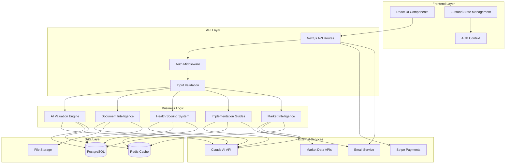

# Components

## AI Valuation Engine

**Responsibility:** Core AI-powered business valuation using multiple methodologies (asset-based, income-based, market-based) with Claude API integration for <3 second response times and 95% accuracy targeting.

**Key Interfaces:**
- `/api/evaluations` - Business data input and valuation request processing
- `/api/evaluations/{id}/valuation` - Retrieve completed valuation results with confidence scores
- Claude AI API integration for multi-methodology analysis and health scoring

**Dependencies:** Claude AI API, BusinessEvaluation data model, Redis cache for response optimization, PostgreSQL for business data persistence

**Technology Stack:** Next.js API routes with persistent connections, Claude AI SDK, Redis for caching, TypeScript for type safety, Zod validation for business data inputs

## Document Intelligence Service

**Responsibility:** AI-powered financial document processing, OCR extraction, data quality assessment, and integration with valuation engine for enhanced accuracy through automated document analysis.

**Key Interfaces:**
- `/api/documents/upload` - Secure file upload with validation and processing triggers
- `/api/documents/{id}/analysis` - AI-extracted financial data and quality assessment results
- Supabase Storage integration for secure document persistence

**Dependencies:** Claude AI API for document analysis, Supabase Storage, DocumentAnalysis data model, file processing utilities, OCR services

**Technology Stack:** Next.js API routes, Claude AI for document intelligence, Supabase Storage with RLS policies, Sharp for image processing, PDF parsing libraries

## User Management & Authentication

**Responsibility:** Complete user lifecycle management including registration, authentication, profile management, and subscription-aware access control throughout the platform.

**Key Interfaces:**
- `/api/auth/*` - Registration, login, password reset, profile updates
- Supabase Auth integration - JWT token management and session persistence
- User profile and business information management

**Dependencies:** Supabase Auth service, User data model, email service for notifications, session management utilities

**Technology Stack:** Supabase Auth with Next.js integration, JWT token handling, React Context for client-side auth state, TypeScript interfaces for user types

## Subscription & Payment Processing

**Responsibility:** Premium subscription management, Stripe integration, trial-to-paid conversion tracking, feature access control, and billing lifecycle management supporting the business model.

**Key Interfaces:**
- `/api/subscriptions` - Subscription creation, updates, cancellation management
- Stripe webhook handling for subscription status updates
- Premium feature gating throughout application components

**Dependencies:** Stripe API, Subscription data model, User model for tier management, webhook verification, email service for billing notifications

**Technology Stack:** Stripe SDK with Next.js, webhook signature verification, subscription status caching, automated billing reconciliation

## Component Diagrams

