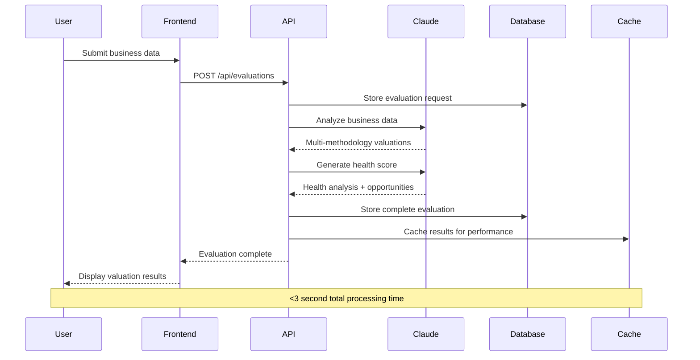
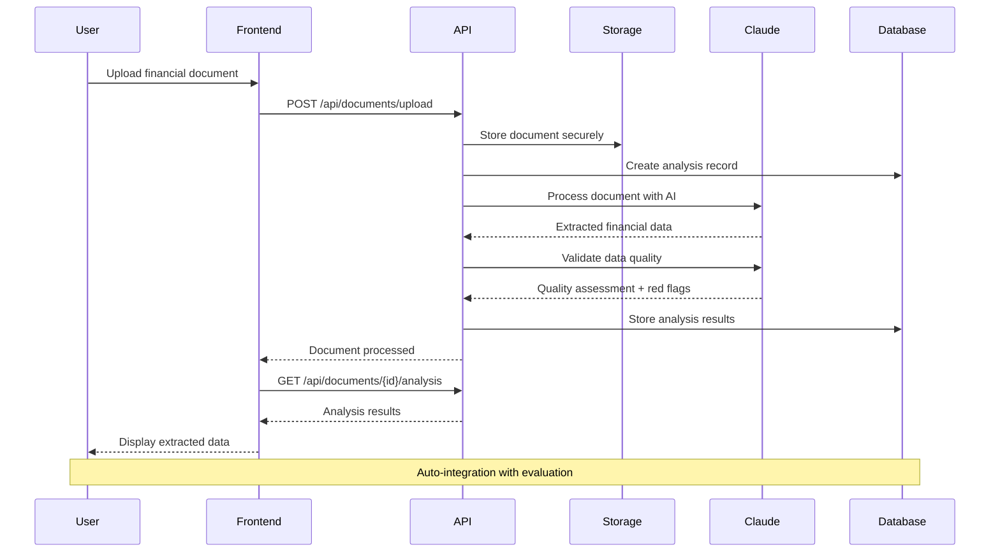
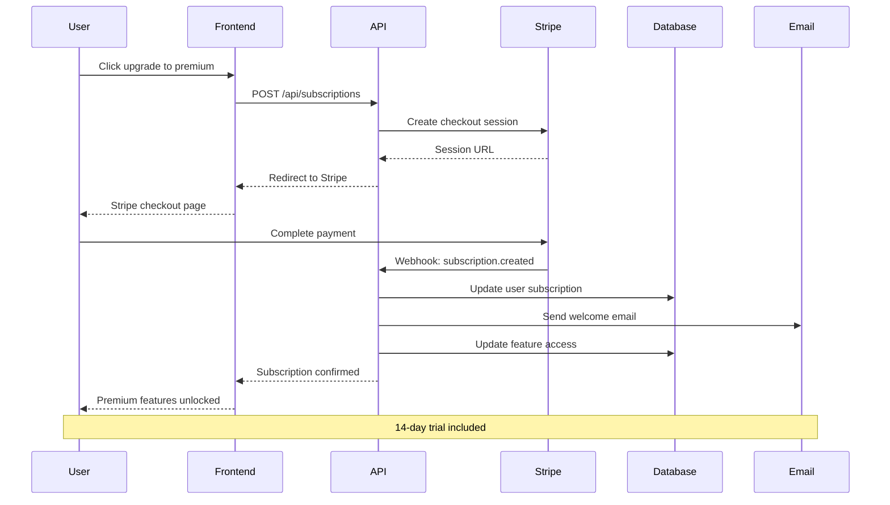

# Core Workflows

## Business Evaluation Workflow

```mermaid
sequenceDiagram
    participant User
    participant Frontend
    participant API
    participant Claude
    participant Database
    participant Cache

    User->>Frontend: Submit business data
    Frontend->>API: POST /api/evaluations
    API->>Database: Store evaluation request
    API->>Claude: Analyze business data
    Claude-->>API: Multi-methodology valuations
    API->>Claude: Generate health score
    Claude-->>API: Health analysis + opportunities
    API->>Database: Store complete evaluation
    API->>Cache: Cache results for performance
    API-->>Frontend: Evaluation complete
    Frontend-->>User: Display valuation results
    
    Note over User,Cache: <3 second total processing time
```

## Document Intelligence Processing Workflow

```mermaid
sequenceDiagram
    participant User
    participant Frontend
    participant API
    participant Storage
    participant Claude
    participant Database

    User->>Frontend: Upload financial document
    Frontend->>API: POST /api/documents/upload
    API->>Storage: Store document securely
    API->>Database: Create analysis record
    API->>Claude: Process document with AI
    Claude-->>API: Extracted financial data
    API->>Claude: Validate data quality
    Claude-->>API: Quality assessment + red flags
    API->>Database: Store analysis results
    API-->>Frontend: Document processed
    Frontend->>API: GET /api/documents/{id}/analysis
    API-->>Frontend: Analysis results
    Frontend-->>User: Display extracted data
    
    Note over User,Database: Auto-integration with evaluation
```

## Premium Subscription Upgrade Workflow

```mermaid
sequenceDiagram
    participant User
    participant Frontend
    participant API
    participant Stripe
    participant Database
    participant Email

    User->>Frontend: Click upgrade to premium
    Frontend->>API: POST /api/subscriptions
    API->>Stripe: Create checkout session
    Stripe-->>API: Session URL
    API-->>Frontend: Redirect to Stripe
    Frontend-->>User: Stripe checkout page
    User->>Stripe: Complete payment
    Stripe->>API: Webhook: subscription.created
    API->>Database: Update user subscription
    API->>Email: Send welcome email
    API->>Database: Update feature access
    API-->>Frontend: Subscription confirmed
    Frontend-->>User: Premium features unlocked
    
    Note over User,Email: 14-day trial included
```
