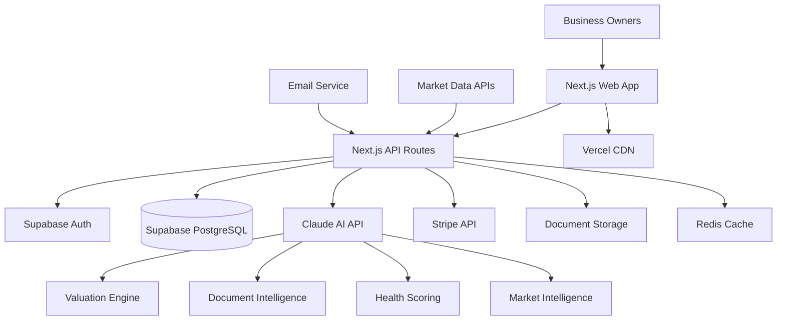

# High Level Architecture

## Technical Summary

GoodBuy HQ employs a traditional server-based Next.js architecture with persistent backend processes to ensure reliable AI processing performance under 3 seconds. The frontend leverages Next.js 14+ with TypeScript and ShadCN/ui components, while the backend utilizes Next.js API routes with dedicated AI processing modules for business valuations, document intelligence, and health scoring. Key integration points include Claude API for AI analysis, Supabase for authentication and PostgreSQL database management, and Stripe for subscription processing. The platform is deployed on Vercel with traditional server capabilities, ensuring consistent performance for AI-intensive workloads while supporting the aggressive 12-16 week MVP timeline and 95% valuation accuracy requirements.

## Platform and Infrastructure Choice

**Platform:** Vercel (Traditional Server Mode)
**Key Services:** Next.js API Routes, Supabase PostgreSQL + Auth, Claude AI API, Stripe Payments, Vercel Analytics
**Deployment Host and Regions:** Vercel Global Edge Network with primary regions in US-East (Virginia) and US-West (Oregon)

**Rationale:** Vercel + Supabase + Claude API provides the optimal balance of development speed, AI processing reliability, and scalability for the GoodBuy HQ MVP while supporting the traditional server architecture requirement for consistent AI processing without cold starts.

## Repository Structure

**Structure:** Monorepo with app-centric organization
**Monorepo Tool:** npm workspaces (lightweight, Next.js native)
**Package Organization:** Separation by domain (web, api, shared, ai-processing) with clear dependency boundaries

This approach enables shared TypeScript interfaces between frontend and backend, centralized AI processing utilities, consistent code quality and testing across all packages, and simplified deployment pipeline for the traditional server architecture.

## High Level Architecture Diagram

## Architectural Patterns

- **Jamstack Architecture:** Static site generation with server-side AI processing - _Rationale:_ Optimal performance for user interfaces while maintaining consistent AI processing capabilities
- **Component-Based UI:** Reusable ShadCN/ui components with TypeScript - _Rationale:_ Rapid development, consistent design system, and type safety across complex business interfaces
- **API-First Design:** RESTful endpoints with OpenAPI specification - _Rationale:_ Clear contracts between frontend and backend, supporting future mobile app development
- **Repository Pattern:** Abstract data access for business entities - _Rationale:_ Clean separation of business logic from data persistence, supporting complex valuation calculations
- **Service Layer Pattern:** Dedicated services for AI processing, payments, and document handling - _Rationale:_ Modular architecture supporting independent scaling and testing of critical business functions
- **Event-Driven Progress Tracking:** Async processing for valuation updates and progress tracking - _Rationale:_ Maintains responsiveness while handling complex AI analysis workflows
